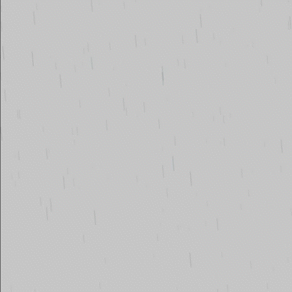

PurpleRain is a simple code written in [P5JS](https://p5js.org/) library which is used to write
Generative Art on browser in javascript language. This code is solely written by
[laksh arora](https://twitter.com/techedlaksh) on
[Youtube](https://www.youtube.com/channel/UCr9M9YTISVaOQKIwaWEPqoA)  

Originally the challenge was done by [Daniel
Shiffman](https://www.youtube.com/c/TheCodingTrain)
